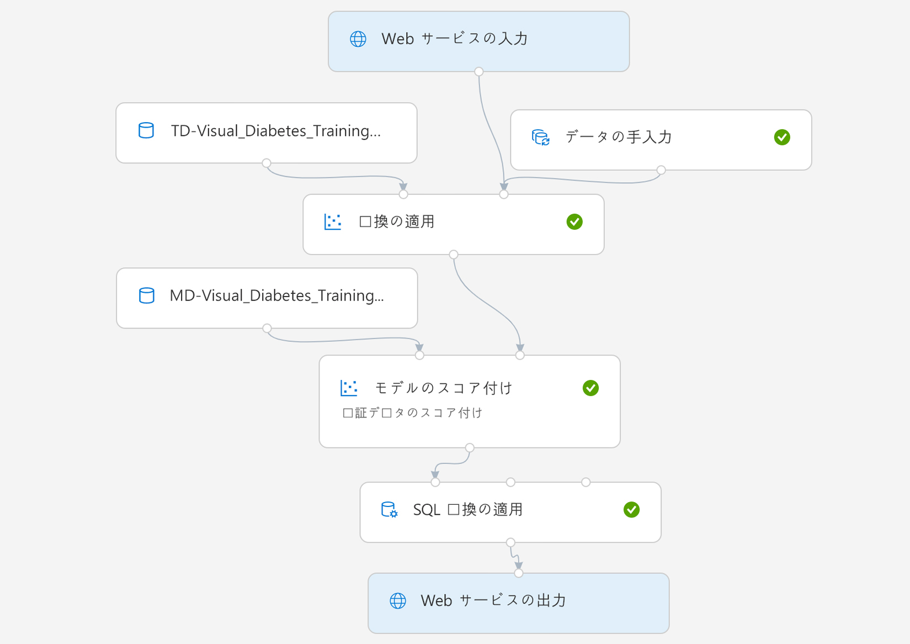

# ラボ 2B: Azure ML Designer を使用したサービスのデプロイ

トレーニング済みのモデルができたので、トレーニング パイプラインを使用して、新しいデータをスコアリングするための推論パイプラインを作成できます。

> **注**: Azure Machine Learning Designer は、執筆時点では*プレビュー*段階にあります。予期しないエラーが発生する場合があります。

## 開始する前に

このラボを開始する前に、このラボで使用する Azure Machine Learning ワークスペースと他のリソースを作成するタスクを含む[ラボ 1A](Lab01A.md) と[ラボ 1B](Lab01B.md) を完了させてください。また、このラボで使用する Designer トレーニング パイプラインを作成するタスクを含む[ラボ 2A](Lab02A.md) を完了させてください。

## タスク 1: 推論コンピューティングを準備する

このラボでは、Azure Kubernetes サービス (AKS) クラスターのコンテナー化されたサービスとして推論パイプラインを公開します。AKS クラスターは初期化に時間がかかるため、推論パイプラインを準備する前にプロセスを開始します。

1. [Azure Machine Learning Studio](https://ml.azure.com) のワークスペースの**コンピューティング** ページで、各タブの下にある既存のコンピューティング先を確認します。これらには、次の内容が含まれます。
    * **コンピューティング インスタンス**: 前のラボで作成したコンピューティング インスタンス。
    * **トレーニング クラスター**: 前のラボで作成した **aml-cluster** コンピューティング先。
    * **推論クラスター**: なし (未作成)
    * **接続されたコンピューティング**: なし (ここは、ワークスペースの外部に存在する仮想マシンまたは Databricks クラスターを接続できる場所です)

2. コンピューティング インスタンスが実行されていない場合は、**コンピューティング インスタンス** タブで起動します。このラボの後半で使用します。

3. **推論クラスター** タブで、次の設定を使用して新しいクラスターを追加します。
    * **コンピューティング名**: aks-cluster
    * **Kubernetes サービス**: 新規作成
    * **リージョン**: *任意の利用可能なリージョン*
    * **仮想マシンのサイズ**: Standard_DS2_v2 (*フィルターを使用して一覧内でこれを検索します*)
    * **クラスターの目的**: Dev-test
    * **ノード数**: 3
    * **ネットワークの構成**: Basic
    * **SSL 構成を有効にする**: 未選択

4. コンピューティング先が*作成中*状態になっていることを確認し、次のタスクに進みます。定期的に戻ってこのページを更新し、クラスターが作成されていることを確認します。

    > **注**: AKS クラスターの作成には、かなりの時間がかかることがあります。作成中にエラーが発生した場合は、障害が発生したクラスターを削除し、別のリージョンを使用して再試行します。

## タスク 2: 推論パイプラインの作成

推論コンピューティングをプロビジョニングしている間に、推論パイプラインをデプロイ用に準備できます。

1. **Designer** ページで、前のラボで作成した**ビジュアル糖尿病トレーニング** パイプラインを開きます。
2. **推論パイプラインの作成**ドロップダウン リストで、**リアルタイム推論パイプライン**をクリックします。数秒後、**ビジュアル糖尿病トレーニング - リアルタイム推論**という名前のパイプラインの新しいバージョンが開きます。
3. 新しいパイプラインの名前を**糖尿病の予測**に変更し、新しいパイプラインを確認します。一部の変換手順とトレーニング手順は、トレーニング データの統計情報を使用して新しいデータ値を正規化し、トレーニング済みのモデルを使用して新しいデータをスコアリングするために使用されるように、このパイプラインにカプセル化されています。
4. 推論パイプラインでは、新しいデータが元のトレーニング データのスキーマと一致するものと仮定されるため、トレーニング パイプラインの**糖尿病データセット** モジュールが含まれます。しかし、この入力データには、モデルが予測する**糖尿病**ラベルが含まれており、糖尿病の予測がまだ行われていない新しい患者データに含めることは直感的ではありません。このモジュールを削除し、**Web サービス入力**と同じ**変換の適用**モジュールの**データセット**入力に接続された**データの入力と出力**セクションの**データの手動入力**モジュールに置き換えます。次に、**データの手動入力**モジュールの設定を変更し、3 つの新しい患者観察用ラベルのない機能値を含む次の CSV 入力を使用します。

    ```CSV
    PatientID,Pregnancies,PlasmaGlucose,DiastolicBloodPressure,TricepsThickness,SerumInsulin,BMI,DiabetesPedigree,Age
    1882185,9,104,51,7,24,27.36983156,1.350472047,43
    1662484,6,73,61,35,24,18.74367404,1.074147566,75
    1228510,4,115,50,29,243,34.69215364,0.741159926,59
    ```

5. 推論パイプラインには**モデルの評価**モジュールが含まれていますが、これは新しいデータから予測する場合には役立たないため、このモジュールを削除します。
6. **モデルのスコアリング** モジュールからの出力には、すべての入力機能、および予測ラベルと確率スコアが含まれます。出力を予測と確率だけに制限するには、**モデルのスコアリング** モジュールと **Web サービス出力**の間の接続を削除し、**Python 言語**セクションから **Python スクリプトの実行**モジュールを追加し、**モデルのスコアリング** モジュールからの出力を **Python スクリプトの実行**の**データセット 1** (左端) 入力に接続し、**Python スクリプト実行**モジュールの出力を **Web サービス出力**に接続します。次に、次のコードを使用して、**Python スクリプトの実行**モジュールの設定を変更します (既存のコードをすべて置き換えます)。

    ```Python
    import pandas as pd

    def azureml_main(dataframe1 = None, dataframe2 = None):

        scored_results = dataframe1[['PatientID', 'Scored Labels', 'Scored Probabilities']]
        scored_results.rename(columns={'Scored Labels':'DiabetesPrediction',
                                       'Scored Probabilities':'Probability'},
                              inplace=True)
        return scored_results


    ```

7. パイプラインが次のようになっていることを確認します。

    

8. トレーニングに使用した **aml-compute** コンピューティング先で、**predict-diabetes**という名前の新しい実験としてパイプラインを実行します。これは時間がかかる場合があります。

## タスク 3: Web サービスを公開する

これで、リアルタイム推論のための推論パイプラインが作成され、クライアント アプリケーションが使用する Web サービスとして公開できます。

1. **コンピューティング** ページに戻り、**推論コンピューティング**タブでビューを更新し、**aks-cluster** コンピューティングが作成されたことを確認します。作成されていない場合は、推論クラスターが作成されるのを待ちます。これにはかなり時間がかかる場合があります。
2. **Designer** タブに戻り、**糖尿病予測**推論パイプラインを再度開きます。まだ実行が終了していない場合は、完了を待ちます。次に、**Python スクリプト**の実行モジュールの出力を視覚化して、入力データ内の 3 つの患者観察の予測ラベルと確率を確認します。
3. 右上の**デプロイ**をクリックし、作成した **aks-cluster** コンピューティング先に **predict-diabetes**という名前の新しいリアルタイム エンドポイントを設定します。
4. Web サービスがデプロイされるまで待ちます。これには数分かかる場合があります。デプロイの状態は、Designer インターフェイスの左上に表示されます。

    > **ヒント**: サービスのデプロイを待っている間に、Azure Machine Learning Designer のドキュメントを [https://docs.microsoft.com/azure/machine-learning/service/concept-designer](https://docs.microsoft.com/azure/machine-learning/service/concept-designer) で確認してみませんか?

## タスク 4: Web サービスをテストする

これで、クライアント アプリケーションからデプロイする済みのサービスをテストできます。この場合、Notebook VM で Notebook を使用します。

1. **エンドポイント** ページで、**predict-diabetes** のリアルタイム エンドポイントを開きます。
2. **predict-diabetes** のエンドポイントが開いたら、**使用**タブで、**REST エンドポイント**と**主キー**の値をメモします。
3. 別のブラウザー タブで、Azure Machine Learning Studio のワークスペースの**コンピューティング** ページを開きます。コンピューティング インスタンスがまだ実行されていない場合は、インスタンスが起動するまで待ちます。次に、その **Jupyter** のリンクをクリックします。
4. Jupyter の**ユーザー/DP100** フォルダーで **02B - Using the Visual Designer.ipynb** を開きます。
5. Notebook で、**ENDPOINT** および **PRIMARY_KEY** のプレースホルダーをサービスの値に置き換えます。これは、エンドポイントのページの**使用**タブからコピーできます。
6. コード セルを実行し、Web サービスから返された出力を表示します。
7. Notebook 内のコードの実行が終了したら、**ファイル** メニューの**閉じて停止**をクリックして閉じ、Python カーネルをシャットダウンします。その後、すべての Jupyter ブラウザー タブを閉じます。

## タスク 5: Web サービスを削除してコンピューティングを停止する

Web サービスは、Kubernetes クラスターでホストされます。これ以上実験する予定がない場合は、不要な Azure 料金が発生しないようにエンドポイントとクラスターを削除します。また、もう一度必要になるまで、他のコンピューティング リソースも停止します。

1. [Azure Machine Learning Studio](https://ml.azure.com) の**エンドポイント** タブで、**predict-diabetes** エンドポイントを選択します。次に、**削除** (&#128465;) ボタンをクリックし、エンドポインの削除を確認します。
2. **コンピューティング** ページの**推論クラスター** タブで、**aks-cluster** エンドポイントを選択します。次に、**削除** (&#128465;) ボタンをクリックし、コンピューティング先の削除を確認します。
3. **コンピューティング** ページの**トレーニング クラスター** タブで、**aml-cluster** コンピューティング先を開き、**編集**をクリックします。次に、**ノードの最小数**設定を **0** に設定し、**更新**をクリックします。
4. **コンピューティング**ページの**コンピューティング インスタンス** タブで、コンピューティング インスタンスを選択し、**停止**をクリックして、インスタンスをシャットダウンします。
